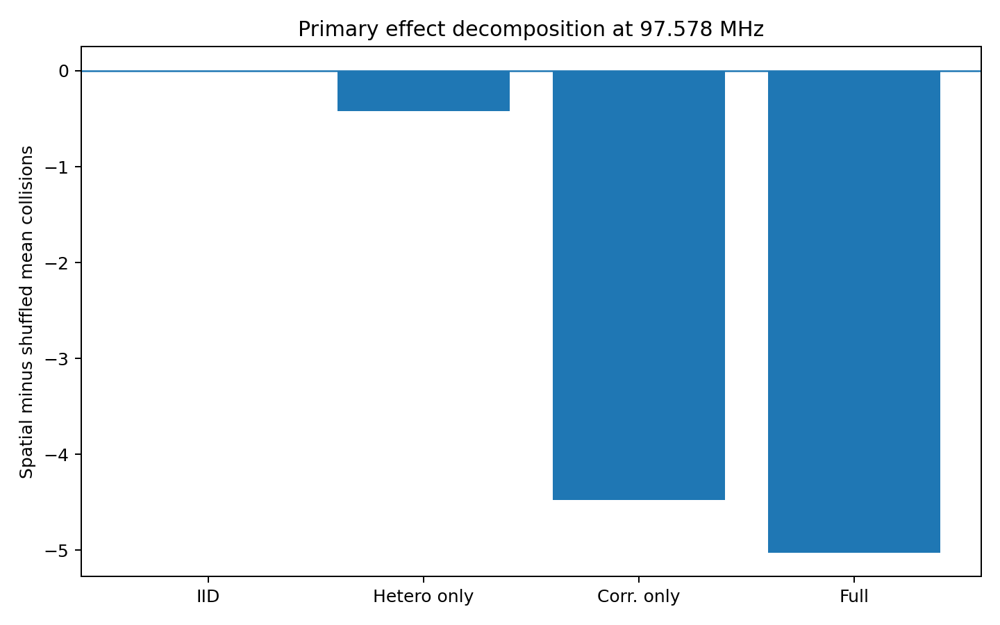
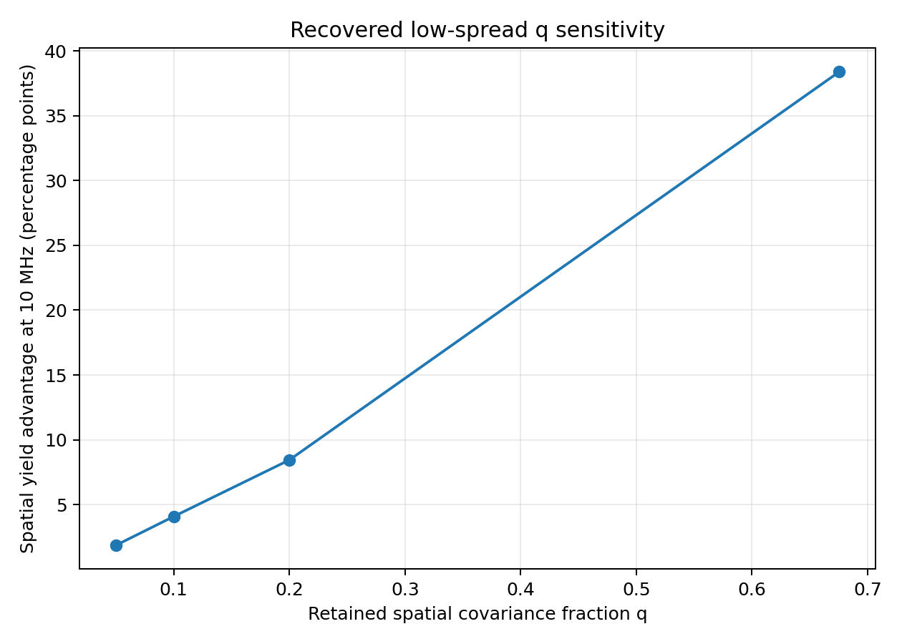
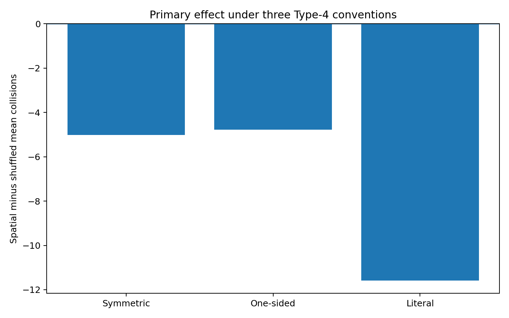

# Spatial Fabrication Variation and Superconducting-Qubit Collision Yield

A computational study of whether the **spatial arrangement** of fabrication-induced qubit-frequency errors changes superconducting-qubit frequency-collision statistics, compared with an exact-value shuffled control that preserves the same realized error values.

## Primary result

The frozen primary experiment uses a measured-data-derived QuTech/Dolan spatial model on a **65-qubit distance-5 heavy-hex processor**.

| Parameter | Value |
|---|---:|
| Total frequency spread, sigma_f | 97.57841384 MHz |
| Spatial covariance fraction, q | 0.67549 |
| Nominal frequency groups | 5.00, 5.07, 5.14 GHz |
| Nominal spacing | 70 MHz |
| Anharmonicity | -330 MHz |
| Paired Monte Carlo realizations | 100,000 |

| Condition | Mean collisions |
|---|---:|
| Spatial assignment | 14.10008 |
| Exact-value shuffled assignment | 19.12500 |
| Spatial minus shuffled | -5.02492 |

The spatial assignment gives a **26.27% lower mean collision burden** than the exact-value shuffled control.

> At the measured-data-derived fabrication scale, spatial assignment itself changes collision statistics even when the realized error values are held fixed.

At this high spread, collision-free processor yield is effectively near zero in both conditions. The primary result is therefore a collision-burden result rather than a practical high-yield processor result.



## Why spatial structure matters

For two qubits i and j,

`Var(f_i - f_j) = Var(f_i) + Var(f_j) - 2 Cov(f_i, f_j)`.

Positive covariance can narrow relative-frequency differences between nearby sites. Because collision conditions depend on frequency differences and combinations, changing the spatial covariance structure can change collision probability even when the overall error distribution is unchanged.

A decomposition of the primary result gives:

| Covariance model | Spatial minus shuffled collisions |
|---|---:|
| IID equal variance | +0.00063 |
| Heterogeneous diagonal only | -0.42270 |
| Equal-marginal correlated | -4.47699 |
| Full primary covariance | -5.02492 |

A symmetric attribution assigns approximately **90.3%** of the primary effect to inter-site correlation and **9.7%** to heterogeneous site variances.

## Low-spread engineering sensitivity

If the fitted pre-tuning covariance fraction q = 0.67549 is preserved while the total frequency spread is reduced to 10 MHz, the model gives:

- **92.584% spatial collision-free yield**
- **54.200% shuffled collision-free yield**
- **+38.384 percentage-point yield advantage**

This is a conditional model result, not an unconditional prediction for a real post-tuned processor.

The later q-sensitivity analysis shows the dependence explicitly:

| q at 10 MHz | Spatial yield advantage |
|---:|---:|
| 0.05 | +1.87 pp |
| 0.10 | +4.09 pp |
| 0.20 | +8.45 pp |
| 0.67549 | +38.384 pp |



The practical effect therefore depends strongly on how much spatial covariance survives process improvement or post-fabrication tuning.

## Robustness checks

The project tested:

- q uncertainty and alternative spatial covariance families
- heteroscedasticity versus inter-site correlation
- three Type-4 collision conventions
- 60/70/80 MHz nominal frequency spacing
- physical-gradient scale-up assumptions
- low-sigma residual covariance
- public LASIQ post-tuning residual data

The sign of the primary spatial effect remained negative under all three audited Type-4 conventions.



## Repository structure

```text
.
├── README.md
├── requirements.txt
├── src/
├── tests/
├── data/
│   ├── raw/
│   └── processed/
├── results/
│   ├── primary/
│   ├── robustness/
│   └── figures/
└── docs/
    └── audit/
```

## Running the tests

```bash
pip install -r requirements.txt
python -m unittest discover -s tests
```

## Documentation

Detailed project material is under `docs/`, including:

- `research_and_methods.md`
- `scientific_synthesis.md`
- `yield_analysis.md`
- `collision_mechanism.md`
- `collision_engine_validation.md`
- `claims_and_limitations.csv`
- `uncertainty_hierarchy.csv`

## Reproducibility status

This public repository was assembled from the final corrected project record. The headline numerical results and scientific interpretation are preserved, but several original binary workbooks, full raw Monte Carlo arrays, and historical script files are not currently available as byte-identical artifacts.

Missing historical artifacts have not been replaced with invented data. The source code under `src/` is a clean reference implementation of the recovered frozen logic and controls.

The complete recovery boundary is documented in `docs/audit/original_artifacts_required.md`.

Accordingly, the repository should currently be described as documenting and partially reproducing the final analysis, rather than as complete raw-data-to-result reproduction.

## Scope of the conclusions

Supported:

1. Spatial assignment changes collision statistics at fixed realized error values in the frozen model.
2. The measured-data-derived primary model lowers mean collision burden by about 26% at 97.58 MHz.
3. Inter-site correlation dominates the primary effect relative to sitewise heteroscedasticity.

Conditional:

4. Large low-spread yield advantages are possible if substantial spatial covariance is retained.

Unresolved:

5. The spatial covariance that survives modern individual post-fabrication tuning.

The project does not claim that IID models are universally pessimistic, that spatial manufacturing-aware quantum-chip simulation is itself a new concept, or that a real 10 MHz tuned processor necessarily receives a 38 percentage-point yield gain.

## Key literature

- J. B. Hertzberg et al., *Laser-annealing Josephson junctions for yielding scaled-up superconducting quantum processors*, npj Quantum Information 7, 129 (2021). https://doi.org/10.1038/s41534-021-00464-5
- Jacques Van Damme, *Scalable Superconducting Qubit Fabrication: A Study of Decoherence*, KU Leuven/imec PhD dissertation (2025).
- SPICE-Q (2026), manufacturing-aware quantum-chip simulation.
